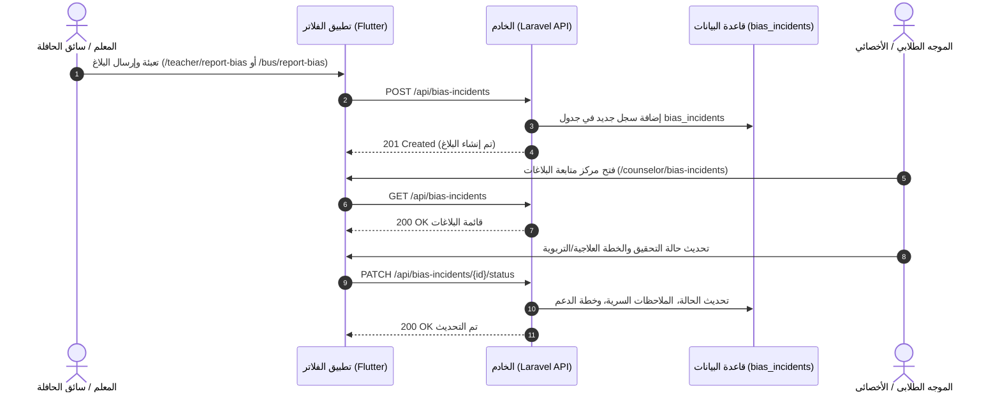
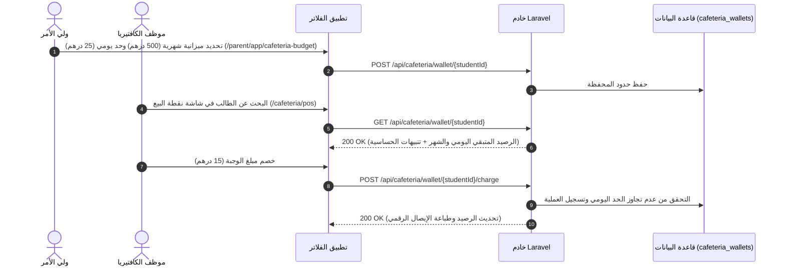

# تطبيق Synapse Health App — التقرير الشامل للميزات والأنظمة المطوّرة

توثّق هذه الوثيقة جميع الميزات الرئيسية، والواجهات البرمجية (APIs)، وجداول قواعد البيانات، والشاشات، والتعريب باللغة العربية التي تم بناؤها وتكاملها في تطبيق **Synapse Health App** خلال هذه الجلسة.

---

## ١. نظام الإبلاغ عن حوادث التمييز والعنصرية (Anti-Racism & Bias Incident Reporting System)

نظام متكامل وشامل عبر قاعدة البيانات والجهة الخلفية (Laravel Backend) وواجهات تطبيق الفلاتر (Flutter Frontend) يتيح الإبلاغ عن حوادث التمييز والعنصرية ومتابعتها ومعالجتها تربوياً وإرشادياً.

### المكونات الرئيسية:
- **نموذج إبلاغ المعلم** ([teacher_bias_report_screen.dart](file:///d:/work/Synapse%20Health%20App/flutter_app/lib/features/teacher/view/teacher_bias_report_screen.dart) — المسار: `/teacher/report-bias`):
  - البحث عن الطالب، تحديد تصنيف الحادثة (إساءة لفظية، استبعاد، إهانات تنمرية)، موقع الحادثة، درجة الخطورة، الوصف الواقعي، الإجراء الفوري المتخذ، قائمة الشهود.
- **نموذج إبلاغ سائق الحافلة** ([bus_bias_report_screen.dart](file:///d:/work/Synapse%20Health%20App/flutter_app/lib/features/bus/view/bus_bias_report_screen.dart) — المسار: `/bus/report-bias`):
  - نموذج مخصص لحوادث النقل والمواصلات المدرسية.
- **مركز إدارة البلاغات للموجه الطلابي** ([counselor_bias_incidents_list_screen.dart](file:///d:/work/Synapse%20Health%20App/flutter_app/lib/features/counselor/view/counselor_bias_incidents_list_screen.dart) — المسار: `/counselor/bias-incidents`):
  - صندوق الوارد المفلتر حسب الحالة (`جديد`، `قيد التحقيق`، `معالج`، `مُصعّد للمدير`).
- **مساحة التحقيق وبناء الخطة الإرشادية** ([counselor_bias_incident_detail_screen.dart](file:///d:/work/Synapse%20Health%20App/flutter_app/lib/features/counselor/view/counselor_bias_incident_detail_screen.dart) — المسار: `/counselor/bias-incidents/:id`):
  - تسجيل ملاحظات التحقيق السرية، تعديل درجة الخطورة، بناء خطة الدعم التربوي والإرشادي للطالب، والتصعيد لمدير المدرسة عند الحاجة.
- **الجهة الخلفية (Laravel Backend)**:
  - هجرة قاعدة البيانات: `2026_08_31_000000_create_bias_incidents_table.php`
  - نموذج Eloquent: `BiasIncident.php`
  - المتحكم: `BiasIncidentController.php` (`index`, `show`, `store`, `updateStatus`)
  - حزمة المسارات: `routes/clusters/bias_incidents.php`
  - البذور التجريبية: `BiasIncidentSeeder.php`

---

## ٢. التعريب الكامل لجميع شاشات مسار المعلم (Teacher Flow Arabic Localization)

تمت مراجعة وتعريب **جميع الشاشات الـ ١٠** لمسار المعلم بالكامل في اللغتين العربية والإنجليزية باستخدام `context.tr` ومراعاة اتجاه واجهة المستخدم في العربية (RTL):

| # | الشاشة | المسار | أبرز تفاصيل التعريب |
|---|---|---|---|
| ١ | [teacher_dashboard_screen.dart](file:///d:/work/Synapse%20Health%20App/flutter_app/lib/features/teacher/view/teacher_dashboard_screen.dart) | `/teacher/home` | ترحيب المعلم، إحصائيات الحضور (`الحاضرون`/`الغائبون`)، تنبيه العاصفة الترابية، بطاقة الحالات الصحية، زيارات العيادة. |
| ٢ | [teacher_attendance_screen.dart](file:///d:/work/Synapse%20Health%20App/flutter_app/lib/features/teacher/view/teacher_attendance_screen.dart) | `/teacher/attendance` | البحث في قائمة الطلاب، أزرار تسجيل الحالة (`حاضر` / `متأخر` / `غائب`)، شريط التقدم اليومي. |
| ٣ | [teacher_bias_report_screen.dart](file:///d:/work/Synapse%20Health%20App/flutter_app/lib/features/teacher/view/teacher_bias_report_screen.dart) | `/teacher/report-bias` | نموذج الإبلاغ عن التمييز والعنصرية، تصنيفات الحوادث، اختيار الموقع والشهود. |
| ٤ | [teacher_clinic_referral_screen.dart](file:///d:/work/Synapse%20Health%20App/flutter_app/lib/features/teacher/view/teacher_clinic_referral_screen.dart) | `/teacher/clinic-referral` | مفتاح الطوارئ العاجلة، اختيار الطالب، إرفاق الصور، شباك تحديد الخطورة والموقع. |
| ٥ | [teacher_health_considerations_screen.dart](file:///d:/work/Synapse%20Health%20App/flutter_app/lib/features/teacher/view/teacher_health_considerations_screen.dart) | `/teacher/health-considerations` | نافذة وشريط خصوصية البيانات (FERPA)، بطاقات الممنوعين من الأنشطة بسبب الطقس، وتصنيفات الحالات (`رياضية`، `غذائية`، `بيئية`). |
| ٦ | [teacher_student_release_notification_screen.dart](file:///d:/work/Synapse%20Health%20App/flutter_app/lib/features/teacher/view/teacher_student_release_notification_screen.dart) | `/teacher/student-release` | بطاقة إشعار استدعاء الطالب للعيادة، زر التأكيد، وشريط نجاح الاستلام. |
| ٧ | [teacher_weather_restriction_screen.dart](file:///d:/work/Synapse%20Health%20App/flutter_app/lib/features/teacher/view/teacher_weather_restriction_screen.dart) | `/teacher/weather-restriction` | بطاقة التنبيه الجوي، قائمة الطلاب الواجب بقاؤهم بالداخل، إقرار المعلم الموثق بالطابع الزمني. |
| ٨ | [teacher_activity_exemptions_screen.dart](file:///d:/work/Synapse%20Health%20App/flutter_app/lib/features/teacher/view/teacher_activity_exemptions_screen.dart) | `/teacher/activity-exemptions` | قائمة الإعفاءات من حصص الرياضة، الأسباب المرتبطة بالطقس، وملاحظات معلم التربية الرياضية. |
| ٩ | [teacher_notification_history_screen.dart](file:///d:/work/Synapse%20Health%20App/flutter_app/lib/features/teacher/view/teacher_notification_history_screen.dart) | `/teacher/notifications` | تصفية الإشعارات حسب الفئة (`تنبيهات طبية`، `الطقس`)، نافذة مسح الكل، والتوقيت النسبي (`منذ ٥ دقائق`). |
| ١٠ | [teacher_settings_screen.dart](file:///d:/work/Synapse%20Health%20App/flutter_app/lib/features/teacher/view/teacher_settings_screen.dart) | `/teacher/settings` | بطاقة الملف الشخصي، مفاتيح التنبيهات الإلزامية، رابط اتفاقية السرية (UAE PDPL)، وتأكيد تسجيل الخروج. |

---

## ٣. نظام ميزانية الكافتيريا والحد اليومي للشراء (Cafeteria Budget & Daily Limit System)

نظام مالـي متكامل يتيح لولي الأمر تحديد ميزانية شهرية وحد يومي للشراء لكل ابن/ابنة، ويمكّن موظف الكافتيريا من الاطلاع على رصيد الطالب والتحقق من التنبيهات الصحية قبل الشراء في نقطة البيع (POS).

### المكونات الرئيسية:
- **شاشة ميزانية الكافتيريا لولي الأمر** ([parent_cafeteria_budget_screen.dart](file:///d:/work/Synapse%20Health%20App/flutter_app/lib/features/parent/view/parent_cafeteria_budget_screen.dart) — المسار: `/parent/app/cafeteria-budget`):
  - التنقل بين الأبناء.
  - بطاقة الميزانية الشهرية المتبقية (مثال: `المتبقي 454.50 درهم من أصل 600.00 درهم`).
  - بطاقة الحد اليومي المتبقي لليوم (مثال: `المتبقي 18.00 درهم من أصل 30.00 درهم`).
  - نموذج تعديل الميزانية والحد اليومي مع التحقق الفوري.
  - سجل مشتريات الكافتيريا المباشر (اسم الوجبة، التاريخ/الوقت، المبلغ الخصم، اسم الموظف).
  - اختصار مباشر في لوحة تحكم ولي الأمر.
- **شاشة نقطة بيع الكافتيريا لموظف المدرسة** ([cafeteria_pos_screen.dart](file:///d:/work/Synapse%20Health%20App/flutter_app/lib/features/cafeteria/view/cafeteria_pos_screen.dart) — المسار: `/cafeteria/pos`):
  - البحث عن الطالب واختياره.
  - شريط التنبيهات الصحية والتغذوية (مثال: `حساسية الفول السوداني`).
  - عرض المبالغ والحدود المسموح بها للطالب اليوم وخلال الشهر.
  - وجبات سريعة جاهزة مع إمكانية إدخال صنف ومبلغ مخصص.
  - حماية تمنع خصم أي مبلغ يتجاوز الحد اليومي أو الشهر المتبقي.
  - إيصال رقمي فوري لتأكيد عملية الشراء وتحديث الرصيد.
  - شريط وصول سريع من لوحة تحكم الكافتيريا.
- **الجهة الخلفية (Laravel Backend)**:
  - هجرة قاعدة البيانات: `2026_09_01_000000_create_cafeteria_wallets_table.php` (`cafeteria_wallets`, `cafeteria_transactions`)
  - نماذج Eloquent: `CafeteriaWallet.php`، `CafeteriaTransaction.php`
  - المتحكم: `CafeteriaWalletController.php` (`show`, `update`, `charge`, `transactions`)
  - مسارات الحزمة: `routes/clusters/cafeteria.php`
  - البذور التجريبية: `CafeteriaWalletSeeder.php`

---

## ٤. شارات العرض الترويجي "مجاني للشهر الأول" (Free For First Month Badges)

تمت إضافة شارات وبنرات ترويجية بارزة ومصممة بجاذبية عالية باللغتين العربية والإنجليزية (`مجاني للشهر الأول 🎁` / `Free For First Month`) عبر ٣ ميزات رئيسية:

1. **محفظة الإنفاق اليومية والشهرية**:
   - بنر ترويجي بارز في أعلى شاشة [parent_cafeteria_budget_screen.dart](file:///d:/work/Synapse%20Health%20App/flutter_app/lib/features/parent/view/parent_cafeteria_budget_screen.dart).
   - شارة `مجاني الشهر 1` فوق مربع ميزانية الكافتيريا في لوحة تحكم ولي الأمر [parent_home_dashboard_screen.dart](file:///d:/work/Synapse%20Health%20App/flutter_app/lib/features/parent/view/parent_home_dashboard_screen.dart).
2. **ميزات الحافلة المدرسية والتتبع**:
   - بنر ترويجي أعلى شاشة التتبع المباشر للحافلة [parent_bus_live_tracking_screen.dart](file:///d:/work/Synapse%20Health%20App/flutter_app/lib/features/parent/view/parent_bus_live_tracking_screen.dart).
   - شارة `مجاني للشهر الأول` بجانب عنوان بطاقة التتبع في لوحة تحكم ولي الأمر [parent_home_dashboard_screen.dart](file:///d:/work/Synapse%20Health%20App/flutter_app/lib/features/parent/view/parent_home_dashboard_screen.dart).
3. **ميزة تخويل الأشخاص لاصطحاب الطالب**:
   - بنر ترويجي أعلى شاشة إدارة الأشخاص المخولين بالاستلام [parent_authorized_persons_manager_screen.dart](file:///d:/work/Synapse%20Health%20App/flutter_app/lib/features/parent/view/parent_authorized_persons_manager_screen.dart).
   - شارة `مجاني الشهر 1` فوق مربع الأشخاص المخولين في لوحة تحكم ولي الأمر [parent_home_dashboard_screen.dart](file:///d:/work/Synapse%20Health%20App/flutter_app/lib/features/parent/view/parent_home_dashboard_screen.dart).

---

## ٥. المرونة والتعامل مع حالات عدم الاتصال أو عدم التوثيق

- تم تحديث [PickupRepository](file:///d:/work/Synapse%20Health%20App/flutter_app/lib/data/repositories/pickup_repository.dart) لمعالجة استجابات `401 Unauthenticated` أو انقطاع الاتصال تلقائياً والتحول للبيانات المحلية التجريبية، مما يضمن استقرار الواجهة وسلاسة التجربة دون ظهور أخطاء غير معالجة.

---

## ملخص التحقق والجودة

تم إجراء فحص شامل لكافة الملفات المطورة والمنشأة باستخدام `flutter analyze` -> **٠ أخطاء (Zero Issues)!**
